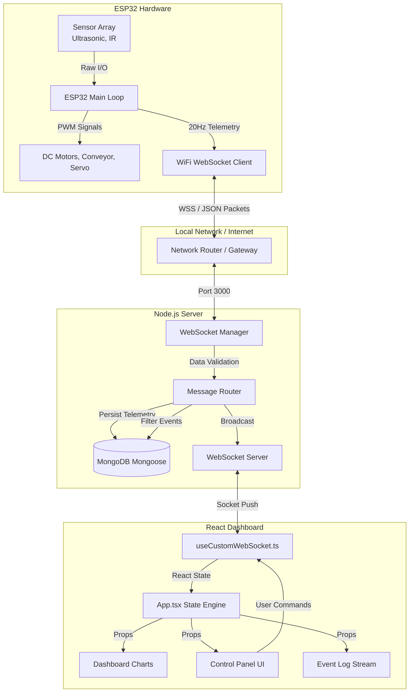
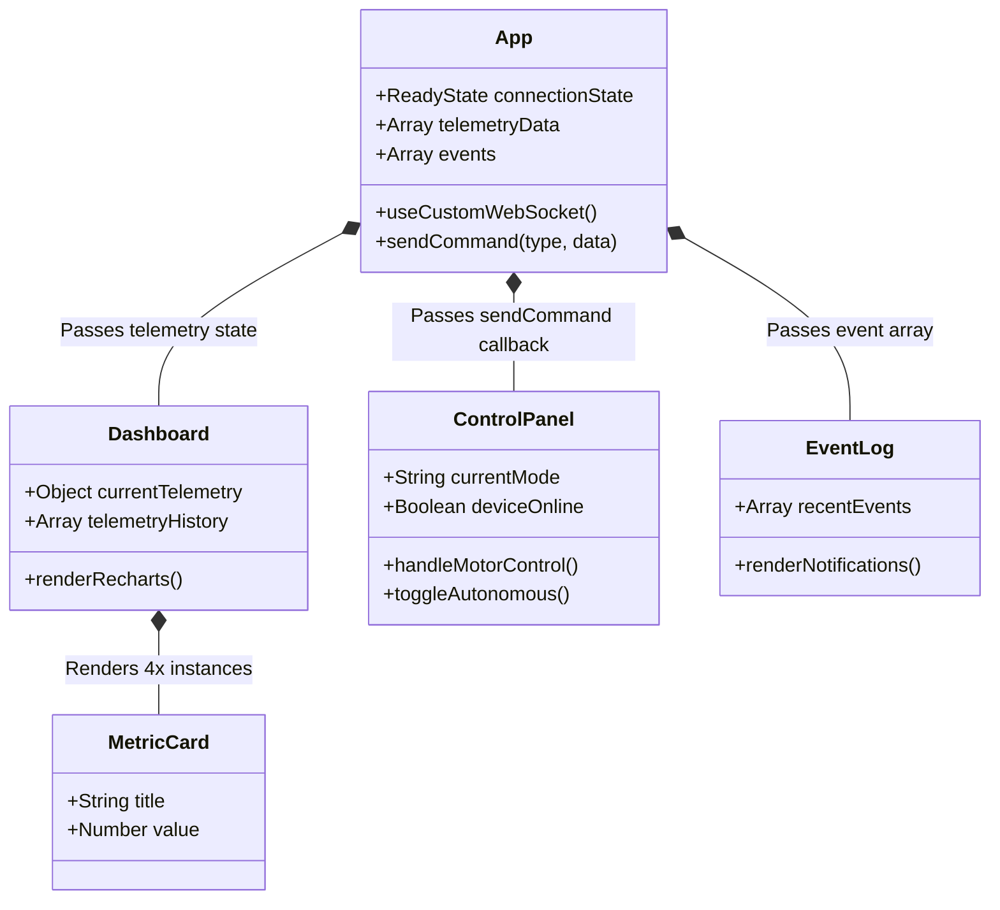
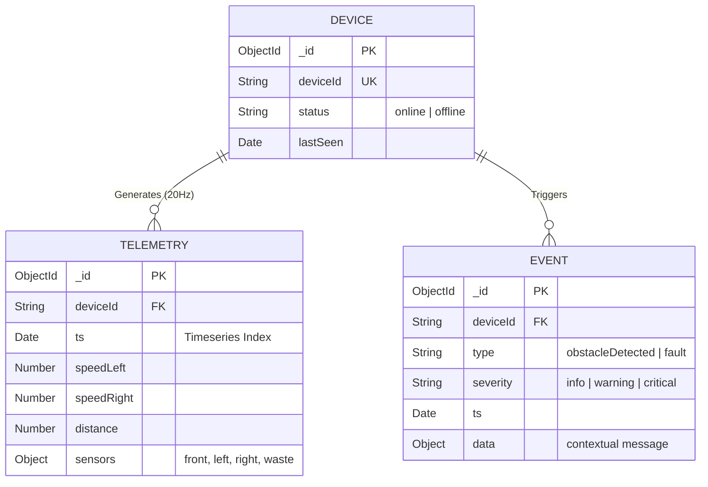
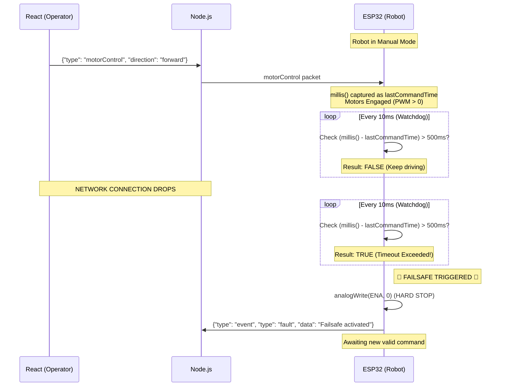
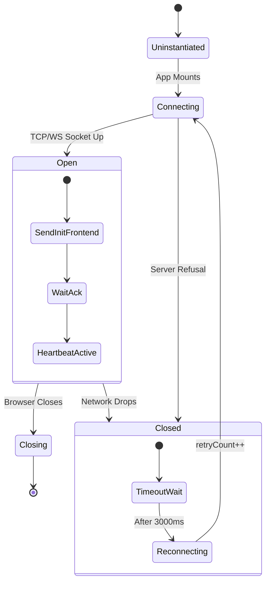
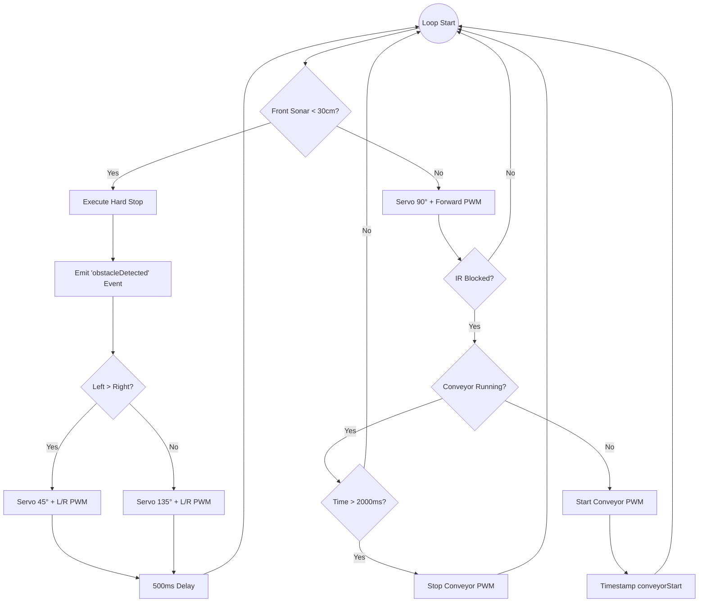

# Comprehensive System Architecture & Flowcharts

This document provides an in-depth visualization of the AquaBot IIoT platform's internal mechanics, networking, state logic, and database architecture using detailed Mermaid diagrams.

---

## 1. Complete System Data Flow (DFD)

This diagram illustrates the macro-level data flow across all three layers of the stack: Edge (Hardware), Server (Node.js), and Client (React).

---

## 2. Advanced Component Architecture (React Frontend)

Visualizing the exact component tree and state propagation down the React application.

---

## 3. Database Entity Relationship Diagram (ERD)

This illustrates the MongoDB relational structure (simulated via Mongoose references).

---

## 4. Hardware Failsafe & Dead-Man's Switch Logic

This sequence visualizes the critical safety mechanism that prevents the robot from losing control if the network connection dies while motors are active.

---

## 5. End-to-End WebSocket Handshake & Resurrection

Demonstrating the explicit handshake protocol and auto-reconnect resilience built into the frontend hook.

---

## 6. Autonomous Evasion State Machine (Robot Brain)

The exact micro-decisions made by the ESP32 while in autonomous operating mode.

